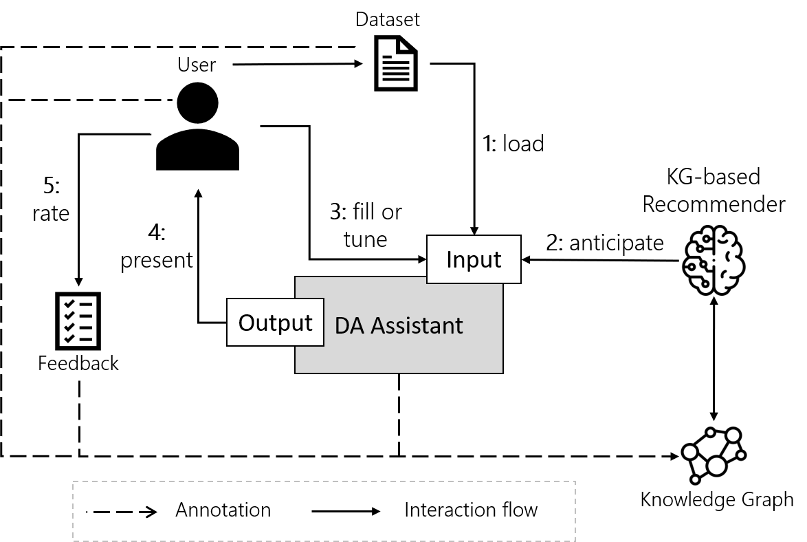

# Capturing and Anticipating User Intents in Data Analytics via Knowledge Graphs

This repository contains the main scripts and Knowledge Graph for the work **Capturing and Anticipating User Intents in Data Analytics via Knowledge Graphs**, focusing on: 
- Capturing of user intents, user preferences, and constraints in a newly designed Knowledge Graph.
- Suggesting the end-users the different input parameters, enabling them to interact in a more efficient and intuitive manner with Data Analytics Assistants system.

To achieve it, different steps have been followed: 
1. A Knowledge Graph has been **designed** to capture all the requiered concepts and relationships related to the data mining domain and the user interaction with the system, so that the generated knowledge graph can be used in a future step to derive valid workflows.
2. The Knowledge Graph has been **populated** with ML workflows from various sources.
3. **Experiments** have been conducted to assess how well KGE and GNN can capture the KG's structure to provide recommendations with Link Prediction, and how sensible are these recommendations. 
4. Inference algorithms have been applied to the populated knowledge graph in a prototype UI, so that it can be used to find **relevant intents, constraint and preferences** (e.g., serve as a reccomender system).

The repository is organized as follows: in the *Knowledge Graph* folder, the ontology .nt files can be found, alongside with the scripts used to generate them. Then, in the ontology *Knowledge Graph* folder the scripts for creating the instances from the different sources can be found. Then, the *Experiments* folder contains the scripts used to conduct the Link Prediction experiments. Finally, in the *UI* folder, the script to execute a prototype of the whole system can be found. A video demo of the prototype can be found [here](https://youtu.be/MMHCoE6yonw).

