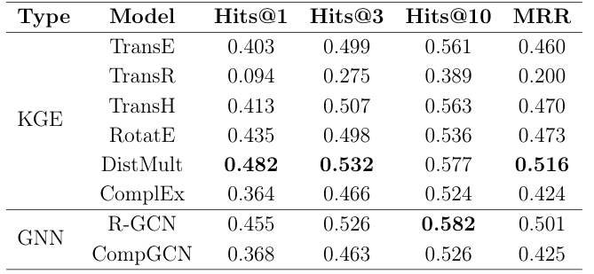
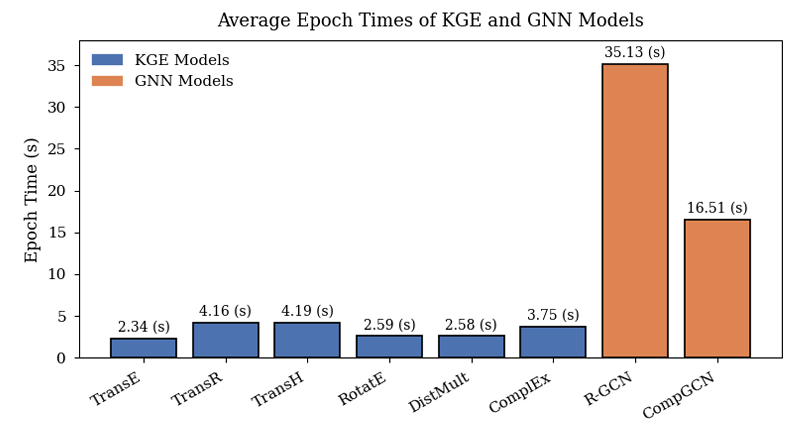

# LINK PREDICTION

This folder contains main scripts for the **Link Prediction** experiments. The main library used is *PyKEEN*, which is has a wide range of embedding models already implemented. In the *experiments.py* file, the script to run the different experiments presented in the Paper can be found. The *hpo.py* file contains the script to generate the final Hyperparameter Tuning Optimization step.

Additionally, the library *torchKGE* has also been used to implement the fine tuning of models, as it has to be done ad-hoc. This will be used in the UI to generate the recommendations as the user fills in the input.

The results are presented in the following Table, where it can be seen that DistMult, a KGE
 model, is the overall best performing method, obtaining the best results for
 MRR, Hits@1 and Hits@3, while achieving only slightly worse Hits@10 re
sults than the second best model (i.e., R-GCN). Therefore, GNNs do not necessarily outperform KGE models.

Additinally a time analysis has been conducted, where it can be observed that the average time for a training epoch is significantly higher for GNN models. For instance, the slowest KGE model (i.e., TransR) is 4 times faster than the fastest GNN model (i.e., CompGCN). 

